# Serverless-project
An Infrastructure as Code (IaC) for a basic serverless application that includes an API Gateway, Lambda functions, and a DynamoDB table.

# Brief project summary
In this project, DynamoDB acts as backend, AWS Lambda acts as the web server, API gateway acts as the frontend

# Architectutral diagram
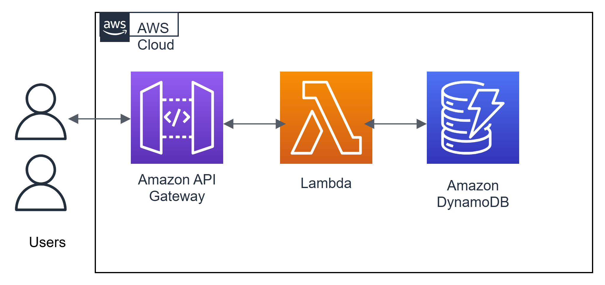

# Project prerequisites
1. An AWS account
2. A Github account
3. An IDE, for example VSCode

# STEPS

# Step 1
Create a GitHub repository

# Step 2
Clone the repository and open the folder of the cloned repo

git clone https://github.com/DorcasChidinma/Serverless-project.git

# Step 3 
Create an IAM role for the Lambda function. Attached the AWS Lambda Basic Execution role (which provides permissions to write logs whenever executions happens) and Amazon DynamoDB Full Access role permission.

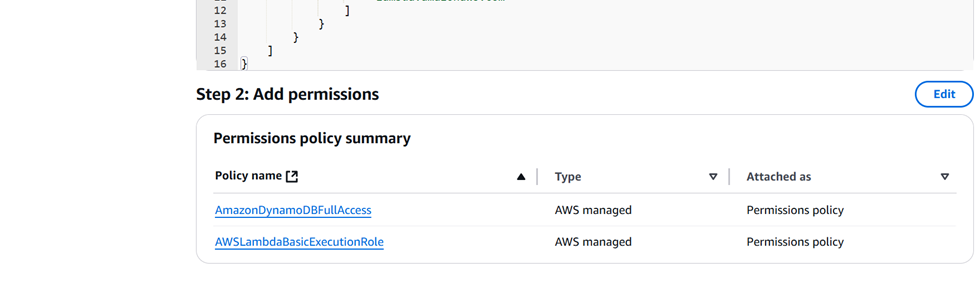

# Step 4
Create a Lambda function (name it), use runtime = Python 3.9, select the IAM role for Lambda function and create the Lambda function

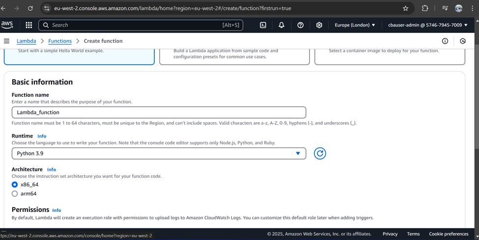

On the AWS console, create a lambda_function.py file. It acts as the web server.

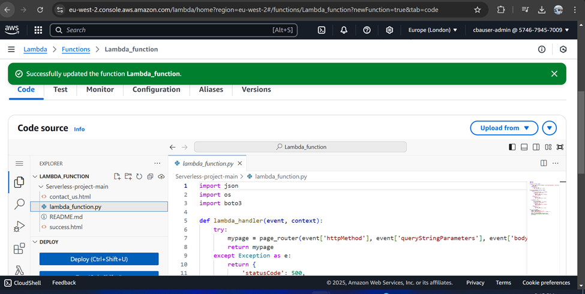

Create an S3 bucket named serverlessitems and upload the contactus.html, success.html and lambda_function.py files.

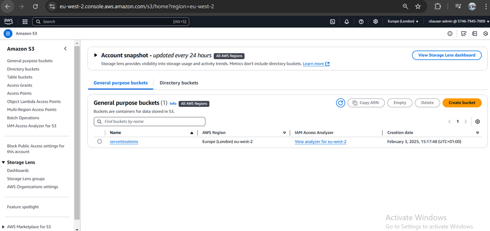

Upload the folder from the S3 bucket

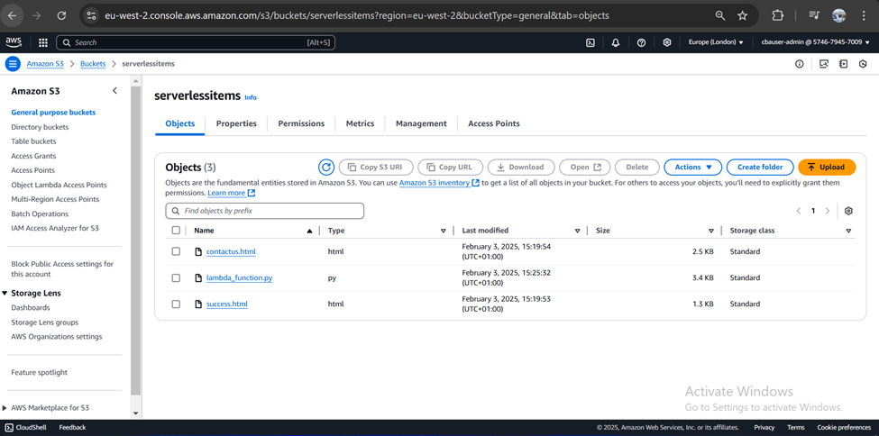

Grant permission to the S3 bucket on the lambda function created.

# Step 5
On the AWS console, create a DynamoDB table

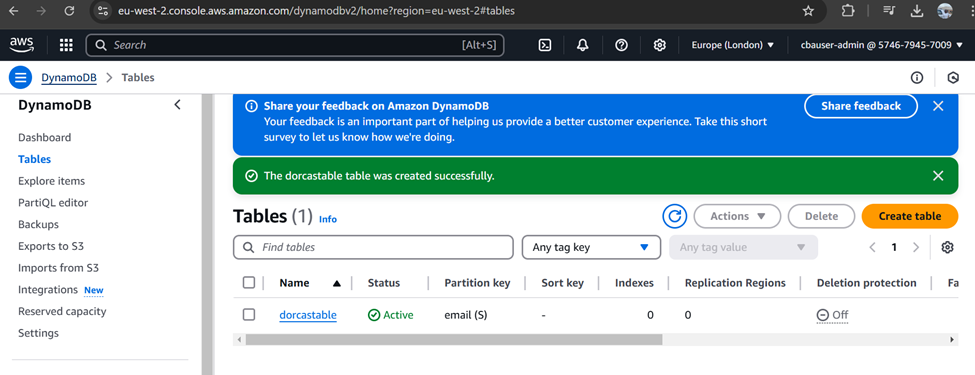

# Step 6
Still on the AWS console, click on API gateway and select Rest API and build 

Click on create method after creating the API. Select “GET” option, select Lambda function, select Lambda proxy integration to send the request to the Lambda function as a structured event.

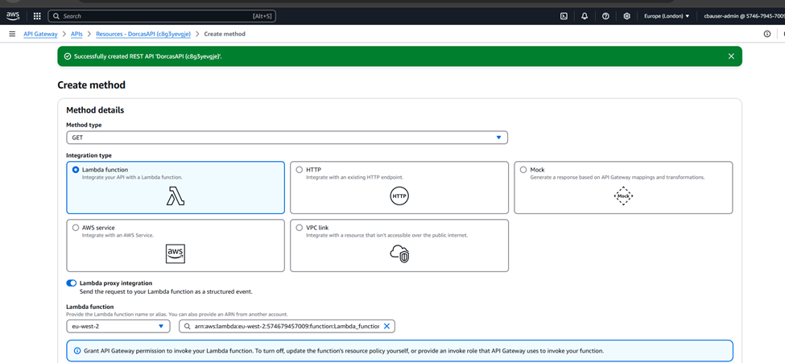

Click on create method and select “POST”. Repeat the same steps as done in “GET”

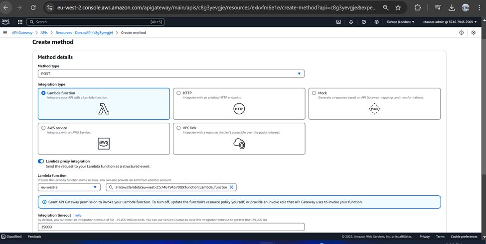

**The “GET” and “POST” are the API gateways with endpoints for the CRUD (Create Read Update and Delete)**

# Step 7
 Click on deploy API and choose a stage where API can be deployed e.g dev

 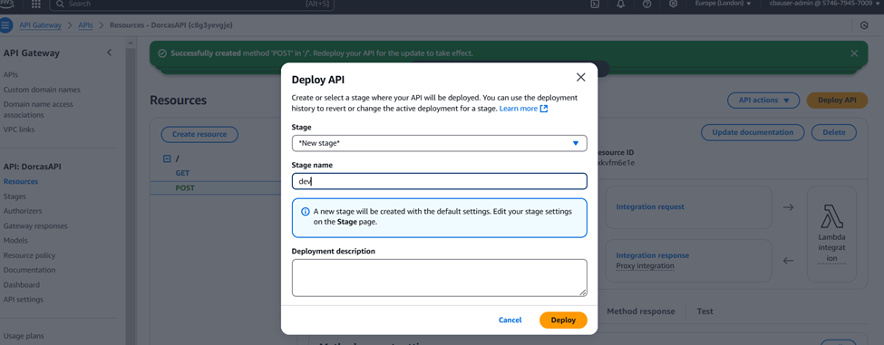

 # Step 8 
 After deployment, copy the invoke URL. It loads the webpage in the lambda function.

 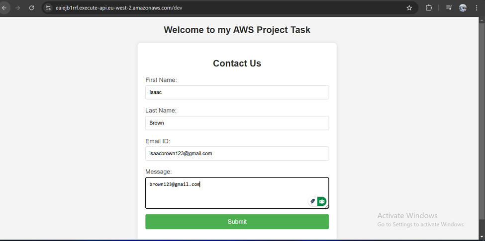

 Input your details and submit 

 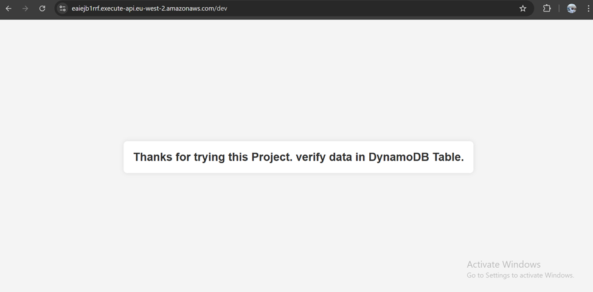

# Step 9
Go to the DynamoDB table and select explore items.

